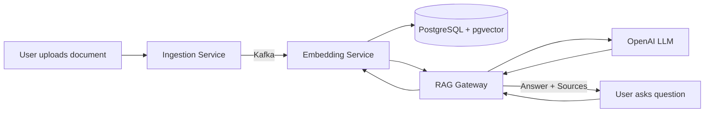

# AI RAG Kafka Streaming Platform

A question-answering system that ingests documents, generates vector embeddings, and uses retrieval-augmented generation (RAG) to answer questions with source references. Built as a set of microservices connected through Kafka.

## How It Works



1. Documents go into the **ingestion service**, which chunks them and publishes to Kafka
2. The **embedding service** consumes chunks, generates vector embeddings, and stores them in PostgreSQL with pgvector
3. When a user asks a question, the **RAG gateway** retrieves the most relevant chunks, sends them as context to an LLM, and returns the answer with source references
4. The **agent service** adds multi-step reasoning with tool calling on top of this pipeline

## Tech Stack

| Component | Technology |
|-----------|------------|
| Ingestion | Go, Fiber |
| Embedding | Python, FastAPI, sentence-transformers |
| RAG Gateway | Java 21, Spring Boot 3 |
| Agent | Python, FastAPI, LangChain |
| Vector DB | PostgreSQL + pgvector |
| Messaging | Apache Kafka |
| Cache | Redis |
| Monitoring | Prometheus, Grafana, Jaeger |

## Project Structure

```
services/
  ingestion/       Go service - document upload, chunking, Kafka producer
  embedding/       Python service - embeddings, vector search, Kafka consumer
  rag-gateway/     Java service - RAG query API, LLM calls, caching
  agent/           Python service - ReAct agent with tool calling
infra/
  docker/postgres/ Database init scripts
observability/     Prometheus and OpenTelemetry configs
scripts/           Bootstrap and cleanup scripts
docs/              Architecture docs and ADRs
api/               OpenAPI spec
eval/              RAG evaluation (RAGAS)
```

## Quick Start

**Prerequisites:** Docker, Docker Compose, Go 1.21+, Python 3.11+, Java 21

```bash
# 1. Start infrastructure (Postgres, Kafka, Redis)
make bootstrap

# 2. Set your OpenAI API key
cp .env.example .env
# edit .env

# 3. Run services (each in a separate terminal)
cd services/ingestion && go run cmd/server/main.go
cd services/embedding && pip install -r requirements.txt && uvicorn app.main:app --port 8001
cd services/rag-gateway && ./gradlew bootRun
```

## Usage

**Ingest a document:**
```bash
curl -X POST http://localhost:8000/api/v1/ingest \
  -H "Content-Type: application/json" \
  -d '{"title": "Example", "content": "Your document text here.", "source": "manual"}'
```

**Ask a question:**
```bash
curl -X POST http://localhost:8080/api/v1/query \
  -H "Content-Type: application/json" \
  -d '{"question": "What does the document say?"}'
```

Response includes the answer and which document chunks were used:
```json
{
  "answer": "Based on the document...",
  "sources": [{"content": "Your document text here.", "score": 0.92}],
  "latencyMs": 230,
  "tokensUsed": 150
}
```

## Kafka Topics

| Topic | Description |
|-------|-------------|
| `documents.raw` | Chunked documents from ingestion |
| `embeddings.ready` | Confirmation after embedding is stored |
| `events.live` | Real-time event stream |
| `rag.query.logs` | Query analytics |

## Service Ports

| Service | Port |
|---------|------|
| Ingestion | 8000 |
| Embedding | 8001 |
| RAG Gateway | 8080 |
| Agent | 8002 |
| Grafana | 3000 |
| Prometheus | 9090 |
| Jaeger | 16686 |

## Tests

```bash
make test
```

Or individually:
```bash
cd services/ingestion && go test ./...
cd services/embedding && pytest tests/
cd services/rag-gateway && ./gradlew test
```

## Docs

- [Architecture](docs/architecture.md)
- [Local Development Guide](docs/local-dev.md)
- [ADR: Vector DB Selection](docs/adr/001-vector-db.md)
- [ADR: Kafka Streaming](docs/adr/002-kafka-streaming.md)
- [Threat Model](security/threat-model.md)
- [API Spec](api/openapi.yaml)

## License

MIT
